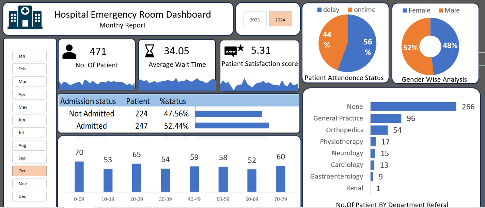

# 🏥 Hospital Emergency Room Dashboard | Excel Project

[](https://www.microsoft.com/excel)
[](https://learn.microsoft.com/en-us/power-query/)

## 📌 Project Overview
An end-to-end Excel dashboard analyzing **9,216 Emergency Room patient records** from a hospital spanning **April 2023 to October 2024**. Raw data was loaded and cleaned using **Power Query**, then transformed into pivot tables and pivot charts, which were arranged sequentially into a single professional dashboard sheet — with no raw data visible to the end user, matching real-world ER reporting standards.

**Goal:** Give hospital administrators a clear, at-a-glance view of ER patient volume, wait times, and satisfaction scores over time — broken down by gender, age group, race, and department referral — so they can identify staffing needs, bottlenecks, and service quality trends.

## 🎯 Business Problem
Hospital ER management needs to monitor three things in near-real time: how many patients are arriving, how long they're waiting, and how satisfied they are with their care. This dashboard answers:
- How many patients visited the ER daily, and what is the overall trend?
- What is the average patient wait time and how does it vary by day?
- How are patient satisfaction scores trending over time?
- Which department receives the most referrals from the ER?
- How are patients distributed by age group, gender, and race?
- What percentage of ER patients are being admitted vs. treated and released?

## 📊 Dataset
| Field | Detail |
|---|---|
| Records analyzed | 9,216 ER patient visits |
| Period | April 2023 – October 2024 |
| Source file | [`hospital_er_data.csv`](./data/hospital_er_data.csv) |
| Fields | Patient Id, Admission Date, First Initial, Last Name, Gender, Age, Race, Department Referral, Admission Flag, Satisfaction Score, Wait Time |

## 🛠️ Tools & Approach
1. **Power Query** – Loaded `hospital_er_data.csv` into Excel, cleaned column types, standardized Gender values (merged "Male"/"M" and "Female"/"F"), and structured the data for pivot analysis — no raw data sheet exposed in the final workbook.
2. **Pivot Tables** – Built separate pivot tables for:
   - Daily ER patient count trend
   - Average wait time daily trend
   - Patient satisfaction score daily trend
   - Breakdown by Department Referral, Age Group, Gender, and Race
3. **Pivot Charts** – Created charts from each pivot table and arranged them in sequence on the final Dashboard sheet.
4. **Excel Dashboard** – Assembled all charts with KPI tiles (total patients, avg wait time, avg satisfaction score, admission rate) into a single clean dashboard sheet.

## 📈 Dashboard Preview


## 🔍 Key Insights (from the actual 9,216-row dataset)
- **9,216 patients** visited the ER between April 2023 and October 2024 — averaging roughly **530 patients per month**.
- **Average wait time: 35.26 minutes** across all visits, with individual wait times ranging from 10 to 60 minutes — a nearly 6x spread that signals significant variation in ER load and triage efficiency.
- **Average patient satisfaction score: 4.99 out of 10** — sitting almost exactly at the midpoint, indicating significant room for service improvement across the ER.
- **Exactly 50% of patients (4,612 of 9,216) were admitted**, meaning the ER functions equally as a treatment-and-release facility and an inpatient gateway — important for bed capacity planning.
- **General Practice is by far the most common department referral** (1,840 referrals — nearly double Orthopedics at 995), suggesting a large share of ER visits are non-specialist cases that may be addressable through better community primary care access.
- **Gastroenterology patients report the highest satisfaction (5.80/10)** while Physiotherapy patients report the lowest (4.99/10) — a gap of nearly 1 full point that warrants department-level service review.
- **Wait times are consistent across all racial groups** (range: 34.6–35.7 minutes), suggesting no systemic racial disparity in ER wait time in this dataset.
- **Patient age is evenly distributed from 1 to 79 years** (~1,100–1,200 patients per decade), meaning the ER serves all age groups equally — no single age group dominates, which matters for resource and equipment planning.

## 🚀 How to Use This Project
```bash
git clone https://github.com/ankitabisht-data-analyst/hospital-er-dashboard-excel.git
```
1. Open [`hospital_er_dashboard.xlsx`](./excel/hospital_er_dashboard.xlsx) in Microsoft Excel (2016 or later recommended).
2. Click **Enable Content** if prompted to allow Power Query and pivot table connections to refresh.
3. Navigate to the **Dashboard** sheet to view the final output.
4. To explore the underlying data, go to **Data > Queries & Connections** in Excel to see the Power Query steps applied.

## 📈 Skills Demonstrated
`Excel` `Power Query` `Pivot Tables` `Pivot Charts` `Dashboard Design` `Data Cleaning` `Healthcare Analytics` `KPI Reporting` `Data Visualization`

## 📬 Contact
**Ankita Bisht** — Data Analyst
[LinkedIn](https://www.linkedin.com/in/ankita-bisht09) · [GitHub](https://github.com/ankitabisht-data-analyst)

⭐ If you found this project useful, consider giving it a star!
